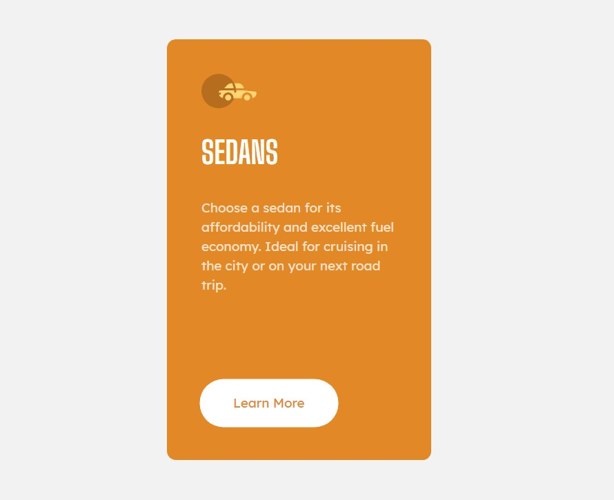
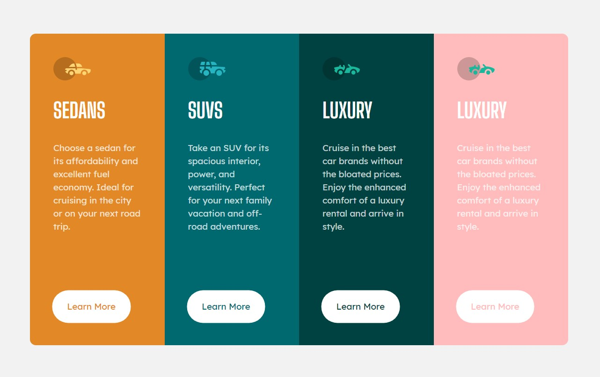

# Frontend Mentor - 3-column preview card component

這是來自[3-column preview card component](https://www.frontendmentor.io/challenges/3column-preview-card-component-pH92eAR2-)的解答。  
Frontend Mentor challenges 是一個藉由實際建立專案，來提升 coding 技術的挑戰。

## 大綱

- [總覽](#總覽)
  - [關於這份挑戰](#關於這份挑戰)
  - [螢幕截圖](#螢幕截圖)
  - [網站連結](#連結)
- [工作流程](#工作流程)
  - [使用的工具](#使用的工具)
  - [我學到什麼](#我學到什麼)
- [特色](#特色)
- [關於作者](#關於作者)
- [致謝](#致謝)

## 總覽

### 關於這份挑戰

你的挑戰是建立出一個三欄式的卡片組件，盡你所能的讓它能夠看起來越接近設計稿越好。

你可以使用任何你喜歡的工具來完成這份挑戰。所以如果你有某個你想要練習的工具，就盡管去嘗試吧！

提示－你的使用者應該要能夠：

- 在他們裝置上得到最佳化的佈局
- 從互動式元件上獲得 "互動（interactive）" 的效果 <font size="2">（Learn more 按鈕）</font>

### 螢幕截圖


### 連結

- Live Site URL: [Here](https://jubeatt.github.io/3-column-preview-card-component/)🥑

## 工作流程

### 使用的工具

- Mobile-first workflow
- Semantic HTML5 markup
- Flex-box
- SCSS (preprocessor)
- BEM (methodology)
- [reset.css](https://meyerweb.com/eric/tools/css/reset/) - For style

### 我學到什麼

#### SCSS 基本操作

- Variable 變數

基本的變數觀念，可以讓我們做一些基本設定的時候變得更加的方便。

```scss
// colors
$primary-white: #fff;
$primary-orange: hsl(31, 77%, 52%);
$normal-cyan: hsl(184, 100%, 22%);
$dark-cyan: hsl(179, 100%, 13%);
$light-gray: hsl(0, 0%, 95%);

// fonts
$primary-font-size: 15px;
$primary-font-family: 'Lexend Deca', sans-serif;
$title-font-family: 'Big Shoulders Display', cursive, sans-serif;
$primary-font-weight: 400;
$title-font-weight: 700;
$primary-font-color: hsla(0, 0%, 100%, 0.75);
$primary-font-line-height: 1.5;
```

這裡主要以網頁會用到的色彩，及文字的相關設定來做為變數。

設立變數最大的好處是，當日後要維護或是更新時，你只要針對變數的部分來做調整，而不用像寫 CSS 一樣還得一個一個去設定，而且也很一目了然！

- Nesting 巢狀結構

```scss
// layout
body {
  // ....

  .main-wrap {
    // ....
  }

  .container {
    // ....
  }
}
```

巢狀結構最大的好處在於能夠一眼看出每個 class 之間的相依關係。

以上面來說，`body`下有 `.main-wrap` 與 `.container`這兩個子層，或反過來說，`main-wrap`與`.continaer`都有一個共同的父層`body`。

另外，上面的 SCSS 編譯成 CSS 後會長這樣：

```css
body {
  /* ... */
}

body .main-wrap {
  /* ... */
}

body .container {
  /* ... */
}
```

我覺得試著去理解它是怎麼被編譯成 CSS，會比去死記硬記來的有幫助，  
畢竟 SCSS 只是個預處理器，它的本質還是 CSS。

順道一提，註解符號 `//` 只有在 SCSS 時它才認得出來。  
所以如果你在 SCSS 中用 `//` 來寫註解，在編譯成 CSS 時是不會有註解的。

如果你希望 CSS 中也能有註解的話，就得在 SCSS 中使用 `/* ... */` 的方式來撰寫。

- 「&」 與父層無縫接軌

這是一個非常有用的選取器，可以讓你把子層與父層給 **"無縫"** 的連接起來。

來看個例子吧：

```scss
.btn {
  color: black;
  &:hover {
    color: white;
  }
}
```

equal to:

等於：

```scss
.btn {
  color: black;
}
.btn:hover {
  color: white;
}
```

所以無縫的意思就是指 「父層與子層之間不會有一個空格（那條縫）」，這是我自己發明的記法，我覺得這樣比較好理解 😆。

這個用法很常用在 `:hover`, `:focus`, `:active`等等的**擬類別**狀態上，所以很重要哦！

#### Get familiar with BEM （與 BEM 培養感情）

當你學會 SCSS 後，再搭配 BEM 的方式來設計 class 名稱，會發現這是一個很方便的組合。  
<font size="2">💡 小提醒：如果你不知道什麼是 BEM 的話，可以先看一下這篇[文章](https://ithelp.ithome.com.tw/articles/10160545)。</font>

簡單來說，BEM 的三大概念就是：

1. Block 區塊
2. Element 元素
3. Modifirer 修飾子

- Structure 結構

所以照著 BEM 的規則，我把這個挑戰的架構切割成下圖：


簡單來說，這裡我把 `card` 當作是一個**組件（component）**，利用這個組件我們就能產出很多張卡片，以及利用 `Modifier` 來為卡片添加不同的樣式。

所以原始碼就會如下：

```html
<!-- card (Block) & card--dark-cyan (Modifier) -->
<section class="card card--dark-cyan">
  <!-- picture (Element) -->
  

  <!-- heading (Element) -->
  <h2 class="card__heading">LUXURY</h2>

  <!-- text (Element) -->
  <p class="card__txt">
    Cruise in the best car brands without the bloated prices. Enjoy the enhanced
    comfort of a luxury rental and arrive in style.
  </p>

  <!-- button (Element) -->
  <a class="card__btn" href="#">Learn More</a>
</section>
```

當你切割出結構後，接著就是 SCSS 出場的時機了。
還記得我們剛剛說過 SCSS 搭配 BEM 是很棒的組合嗎？

一段程式碼勝千言：

  <!-- code is worth a thousand words -->

```scss
//  card component
.card {
  background-color: $primary-orange; /* default-bg-color */
  color: $primary-orange; /* default-color */
  padding: 40px; /* default-spacing */
  .card__ {
    &pic {
      display: block;
      width: 64px;
      height: 40px;
    }
    &heading {
      font-family: $title-font-family;
      font-weight: $primary-font-weight;
      color: $primary-white;
      font-size: 36px;
      margin: 25px 0;
    }
    &txt {
      color: $primary-font-color;
      margin-bottom: 30px;
    }
    &btn {
      background-color: $primary-white;
      display: block;
      color: inherit;
      text-decoration: none;
      padding: 15px 0;
      width: 69.0376569038%; /* 165 / 239 */
      max-width: 300px;
      min-width: 130px;
      text-align: center;
      border-radius: 100px;
    }
  }
}
```

這樣子的結構，我相信比起原始的 CSS，應該是好理解很多的。

所以我們就完成 `card` 這個組件囉：



這裡我們預設讓`card`的顏色為橘色。

所以以上就是整個 `card` 組件的製作流程囉，是不是簡潔又有力呢？

#### 一些 CSS 的技巧

關於桌機板的 3 欄格式，我本來是這樣子撰寫的：

```scss
@media screen and (min-width: 760px) {
  .container {
    display: flex;
    .card {
      flex-basis: 33.33333%; // 100 / 3
    }
  }
}
```

不過後來我想了一下，發現如果要讓他更彈性一點的話，可以改寫成這樣子：

```scss
@media screen and (min-width: 760px) {
  .container {
    display: flex;
    .card {
      flex: 1; // flex-grow : 1
    }
  }
}
```

`flex-grow` 的意思是：把 flex-box 中的剩餘空間根據設定 flex-item 設定的值來分配。

所以拿這個範例來說就是，我有 3 個欄位，3 個欄位皆設定了 `flex-grow: 1`，代表總共有 3 等分，而每一個欄位都會拿走 1/3 的剩餘空間。<font size="2">（換句話說就是 "每個欄位等寬"）</font>

假設現在的總寬度為 `900px` 的話，那每一個欄位的寬度就會是 `300px`。

#### 注意選取器的權重 ⚠

在透過 `media queries` 來覆寫前面的設定時，要很小心 **權重** 的問題。

像我就犯了一個錯：

```scss
// Mobile version
.card {
  // ...
  .card__ {
    &pic {
      // ...
    }
    &heading {
      // ...
    }
    &txt {
      // ...
    }
    &btn {
      // ...
    }
  }
}
```

```scss
// Desktop version
@media screen and (min-width: 760px) {
  .card__ {
    &pic {
      // ...
    }
    &heading {
      // ...
    }
    &txt {
      // ...
    }
    &btn {
      // ...
    }
  }
}
```

如果這樣子寫的話，`media queries` 是沒辦法覆寫掉前面的設定的，因為前者的權重比後面的重。

如果你把編譯成 CSS 後的結果拿出來比較，你會更清楚這兩者的差異：

```css
/* Mobile */
.card .card__pic {
  ...;
}
```

```css
/* Desktop */
@media screen and (min-width: 760px) {
  .card__pic {
    ...;
  }
}
```

所以別像我一樣，不小心忽略了權重的問題，即便在電腦版中我們只有 `.card` 組件中的內容需要調整，也還是要注意前後者的權重關係，不然就會不小心踩到這個陷阱。

## 特色

我希望這個 `card` 組件能夠有一些自定義的功能，所以讓我們再添加一點原始碼吧！

```scss
// optional style
.card--normal-cyan {
  background-color: $normal-cyan;
  color: $normal-cyan;
}
// optional style
.card--dark-cyan {
  background-color: $dark-cyan;
  color: $dark-cyan;
}
```

這樣子就能把喜歡的顏色套用到 `card` 囉。

來點不一樣的吧，讓我們來加個粉紅色 ✨

```scss
$pink: #ffbcbc;

.card--pink {
  background-color: $pink;
  color: $pink;
}
```

💡 別忘了在 HTML 中加入新建立的 class

```html
<section class="card card--pink"></section>
```

完工：



我知道你可能也注意到了，就是圖片的部分沒有隨著設定的顏色來做變化。

不過別擔心，這是因為我們使用的是**圖片檔**，如果你改使用 **icon-font**（像是 [FontAwesome](https://fontawesome.com/)） ，就能解決這個問題囉。

做個簡單的示範：


總而言之，如果你還希望有什麼功能，只要試著去鑽研，相信都能找出解決辦法的。

最後就留給各位自行發揮囉！

## 關於作者

- Website - [Jim's blog](https://jubeatt.github.io/)
- Frontend Mentor - [Jim](https://www.frontendmentor.io/profile/jubeatt)
- Facebook - [薛裕正](https://www.facebook.com/profile.php?id=100003593580513)

## 致謝

最後我想向[Anton](https://www.frontendmentor.io/profile/antarya)
說聲謝謝，在我上一份[挑戰](https://www.frontendmentor.io/solutions/singlepricegridcomponent-by-using-flexbox-k-D7LL4wY)中給了我不少建議。

因為有你的那些建議，讓我在這一次的挑戰中嘗試了我以前不曾使用過的 SCSS， BEM 的 class 命名方式，還有一些 CSS 的技巧（畫面的垂直置中）

其實我這個人還蠻孤僻的 💦，也沒有想過有人在看完我的作品後，會給我這麼詳細的建議。  
總而言之，我很慶幸自己能夠遇到你這樣子的 **"Mentor"** ，謝謝你 😊
