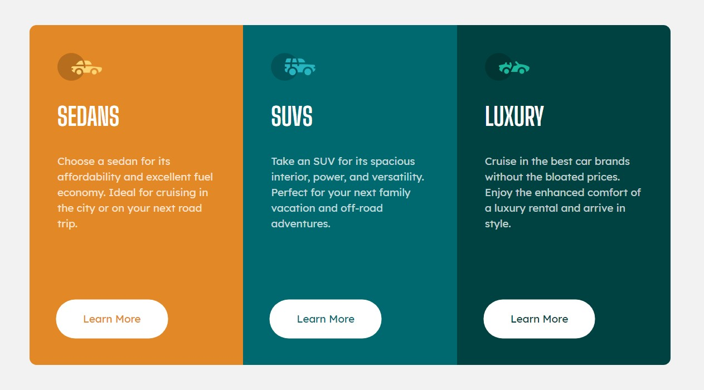
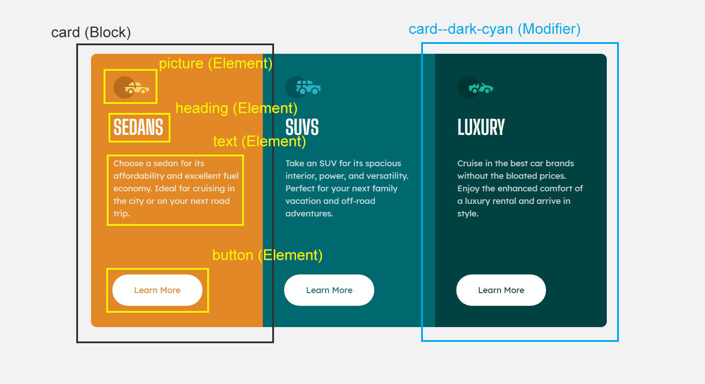
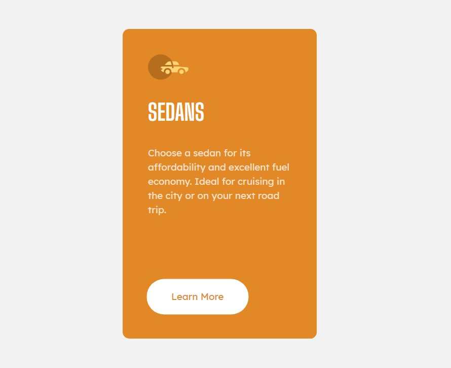
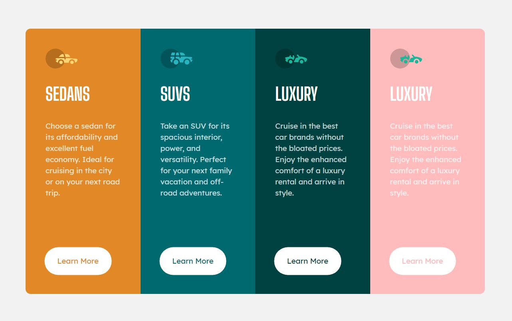
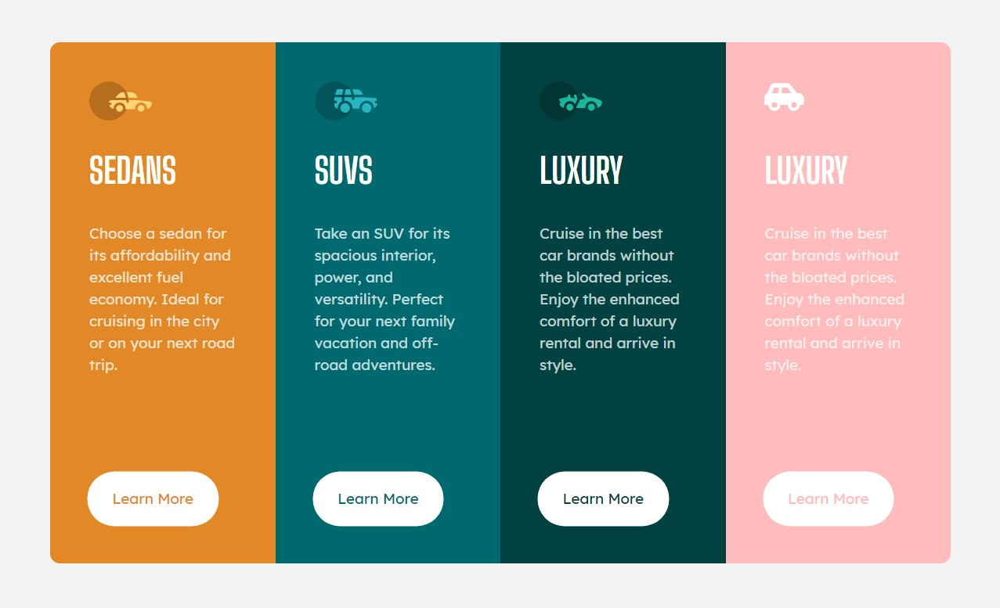

# Frontend Mentor - 3-column preview card component

This is a solution to the [3-column preview card component](https://www.frontendmentor.io/challenges/3column-preview-card-component-pH92eAR2-). Frontend Mentor challenges help you improve your coding skills by building realistic projects.

**<font size="4">友情提示：如果你想看中文解說，可以點[這裡](https://github.com/jubeatt/3-column-preview-card-component-main/blob/master/README-zh.md)🎉</font>**

## Table of content

- [Overview](#overview)
  - [The challenge](#the-challenge)
  - [Screenshot](#screenshot)
  - [Links](#links)
- [My process](#my-process)
  - [Built with](#built-with)
  - [What I learned](#what-i-learned)
- [Featurs](#featurs)
- [Author](#author)
- [Acknowledgments](#acknowledgments)

## Overview

### The challenge

Your challenge is to build out this 3-column preview card component and get it looking as close to the design as possible.

You can use any tools you like to help you complete the challenge. So if you've got something you'd like to practice, feel free to give it a go.

Your users should be able to:

- View the optimal layout depending on their device's screen size
- See hover states for interactive elements <font size="2">（The Learn more button）</font>

### Screenshot



### Links

- Live Site URL: [Here](https://jubeatt.github.io/3-column-preview-card-component-main/)🥑

## My process

### Built with

- Mobile-first workflow
- Semantic HTML5 markup
- Flex-box
- SCSS (preprocessor)
- BEM (methodology)
- [reset.css](https://meyerweb.com/eric/tools/css/reset/) - For style

### What I learned

#### Basic of SCSS

- Variable

I learned some concepts of variables, It can make things easy when setting some base style like `color`, `font-size`, etc.

```scss
// colors
$primary-white: #fff;
$primary-orange: hsl(31, 77%, 52%);
$normal-cyan: hsl(184, 100%, 22%);
$dark-cyan: hsl(179, 100%, 13%);
$light-gray: hsl(0, 0%, 95%);

// fonts
$primary-font-size: 15px;
$primary-font-family: 'Lexend Deca', sans-serif;
$title-font-family: 'Big Shoulders Display', cursive, sans-serif;
$primary-font-weight: 400;
$title-font-weight: 700;
$primary-font-color: hsla(0, 0%, 100%, 0.75);
$primary-font-line-height: 1.5;
```

Here are some reusable properties like color, text on the webpage, and we put them to variables.

This benefit of it is Maintainability, and it's clear too.

When someday you want to update or fix some problem.  
All you need is to change the variable.

You don't have to change everything one by one like CSS as before.

- Nesting

```scss
// layout
body {
  // ....

  .main-wrap {
    // ....
  }

  .container {
    // ....
  }
}
```

The greatest advantage of Nesting is that you can easily know the relationship between classes by one looking.

The code on top means `body` has two children, `.main-wrap` and `.container`.  
Conversely, `.main-wrap` and `.container` have a same parent `body`.

In addition, The SCSS code on top compiles to CSS will look like this:

```css
body {
  /* ... */
}

body .main-wrap {
  /* ... */
}

body .container {
  /* ... */
}
```

In my opinion, try to figure out how the CSS be compiled, it would be better than remember that by rote.  
After all, SCSS is just a preprocessor, The essence of it is still CSS.

So if you write comments by using `//` in SCSS, there is no comment in CSS after compilation.  
If you want to create comments in the CSS, you have to write comments by using `/* ... */` in your SCSS.

- 「&」 get close to parent

This is a very useful selector that can make children nearby its parent with **"no gaps"**.

Let's see an example:

```scss
.btn {
  color: black;
  &:hover {
    color: white;
  }
}
```

equal to:

```scss
.btn {
  color: black;
}
.btn:hover {
  color: white;
}
```

As you can see, there is no **"white space"** between the parent and the children, and that's why I said there are **"no gaps"**. Personally, I think it is more easily to remember that, so I call it **"no gaps"**.😆

It's usually come with **pseudo-class** like `:hover`, `:focus`, `:focus` and so on.  
So keep in mind. it's important.

#### Get familiar with BEM

After you learned SCSS, It's time to meet BEM. It's a good combination when you put them together.  
<font size="2">💡 help：If you don't know what is BEM, you can read this [article](https://css-tricks.com/bem-101/) first.</font>

In brief, the main points of BEM are :

1. Block
2. Element
3. Modifirer

- Structure

So, follow the rules of BEM, I build a structure like the following picture :



Here, I regard `card` as a **"component"**, so we can create a lot of cards by using it.  
Also, The `Modifier` would allow us to build different style for the card.

So the code will look like :

```html
<!-- card (Block) & card--dark-cyan (Modifier) -->
<section class="card card--dark-cyan">
  <!-- picture (Element) -->
  

  <!-- heading (Element) -->
  <h2 class="card__heading">LUXURY</h2>

  <!-- text (Element) -->
  <p class="card__txt">
    Cruise in the best car brands without the bloated prices. Enjoy the enhanced
    comfort of a luxury rental and arrive in style.
  </p>

  <!-- button (Element) -->
  <a class="card__btn" href="#">Learn More</a>
</section>
```

After you find out the structure, then it's time to use SCSS.  
Remember that? we said when you put them together, it will be a good combination.

Code is worth a thousand words :

```scss
//  card component
.card {
  background-color: $primary-orange; /* default-bg-color */
  color: $primary-orange; /* default-color */
  padding: 40px; /* default-spacing */
  .card__ {
    &pic {
      display: block;
      width: 64px;
      height: 40px;
    }
    &heading {
      font-family: $title-font-family;
      font-weight: $primary-font-weight;
      color: $primary-white;
      font-size: 36px;
      margin: 25px 0;
    }
    &txt {
      color: $primary-font-color;
      margin-bottom: 30px;
    }
    &btn {
      background-color: $primary-white;
      display: block;
      color: inherit;
      text-decoration: none;
      padding: 15px 0;
      width: 69.0376569038%; /* 165 / 239 */
      max-width: 300px;
      min-width: 130px;
      text-align: center;
      border-radius: 100px;
    }
  }
}
```

I believe It's more clear than vanilla CSS. Right?😉

So, that's all for the `card` component.



By the way, this color is a default value of a card.

#### Some CSS tricks

Regarding the 3-column layout on the desktop, this is my code at the beginning.

```scss
@media screen and (min-width: 760px) {
  .container {
    display: flex;
    .card {
      flex-basis: 33.33333%; // 100 / 3
    }
  }
}
```

But I guess there should be an approach to make it more flexible.

So I rewrite the code, and it looks like this :

```scss
@media screen and (min-width: 760px) {
  .container {
    display: flex;
    .card {
      flex: 1; // flex-grow : 1
    }
  }
}
```

`flex-grow` means: put the remaining space of flex-box into each flex-item.  
The distribution of space depends on the `flex-grow` you set.

In this case, we have 3 columns, each column set `flex-grow` to 1.  
So that's mean the sum is 3, and then a column takes 1 from the sum.  
In other words, each column will take 1/3 space from the sum.  
<font size="2">I think my translation is not very well, but anyway, it means each column has "equal width".💦</font>

So now suppose the width is `900px`, then each column's width will be `300px`.

The benefit of this approach is no matter how many cards you create.
It will keep the same width at the end.

#### Be careful with CSS specificity ⚠

When you try to use `media queries` to overwrite the setting, you must be careful with CSS **specificity**.

yeah.. I'm the first guy who makes this mistake :

```scss
// Mobile version
.card {
  // ...
  .card__ {
    &pic {
      // ...
    }
    &heading {
      // ...
    }
    &txt {
      // ...
    }
    &btn {
      // ...
    }
  }
}
```

```scss
// Desktop version
@media screen and (min-width: 760px) {
  .card__ {
    &pic {
      // ...
    }
    &heading {
      // ...
    }
    &txt {
      // ...
    }
    &btn {
      // ...
    }
  }
}
```

If you write the code like that, it will not work. because the former has more specificity than the latter.

It's more clear when it compiles to CSS.

```css
/* Mobile */
.card .card__pic {
  ...;
}
```

```css
/* Desktop */
@media screen and (min-width: 760px) {
  .card__pic {
    ...;
  }
}
```

So don't forget CSS specificity just like me.

Even though we only just change the properties in the `.card` component on the desktop, we still need to notice CSS specificity of both, otherwise, you may Step on the trap.

## Featurs

I hope the card could be customized, so let's add some code!

```scss
// optional style
.card--normal-cyan {
  background-color: $normal-cyan;
  color: $normal-cyan;
}
// optional style
.card--dark-cyan {
  background-color: $dark-cyan;
  color: $dark-cyan;
}
```

So now you can apply any colors to a `card` by your preference.

Want something interesting? let's add a pink.✨

```scss
$pink: #ffbcbc;

.card--pink {
  background-color: $pink;
  color: $pink;
}
```

💡 Don't forget to put the class into HTML.

```html
<section class="card card--pink"></section>
```

Done：



I know you may notice that the picture doesn't look consistent with our setting.

Don't worry, it's because we use **image files** here, you can fix this problem by using **icon-font** (e.g., [FontAwesome](https://fontawesome.com/))

Here's a simple demo :



In conclusion, If you want to build a new feature, just delve into it, try to figure out the solution.

I believe there must be a way you can find it.

## Author

- Website - [Jim's blog](https://jubeatt.github.io/)
- Frontend Mentor - [Jim](https://www.frontendmentor.io/profile/jubeatt)
- Facebook - [薛裕正](https://www.facebook.com/profile.php?id=100003593580513)

## Acknowledgments

In the end, I want to say thanks to [Anton](https://www.frontendmentor.io/profile/antarya), who gives me a lot of advice on the last [challenge](https://www.frontendmentor.io/solutions/singlepricegridcomponent-by-using-flexbox-k-D7LL4wY).

With your advice, I try the tools that I've never used on this challenge. (SCSS, BEM, and some CSS tricks, e.g., vertically centered)

To be honest, I'm kind of a hermit💦, and I didn’t expect someone who watched the challenge would give me so useful suggestions.

All in all, I appreciate that I can meet the **Mentor** who like you, Thank you.😊
